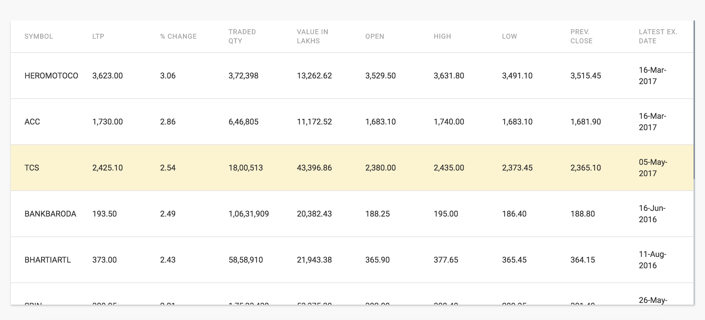

### StandAlone using Cherrypy

#### Prerequisites
1. Redis 6+ installed
2. Cherrypy installed
3. PhantomJS installed
4. Selenium webdrivers installed

Everytime we try to re-run the app, we need to insure the `index.html` file contains `indexTemplate.html` contents
 
#### Running the app

    python app.py

#### Screenshot

